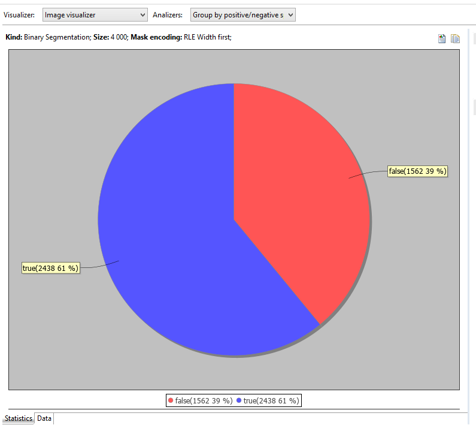
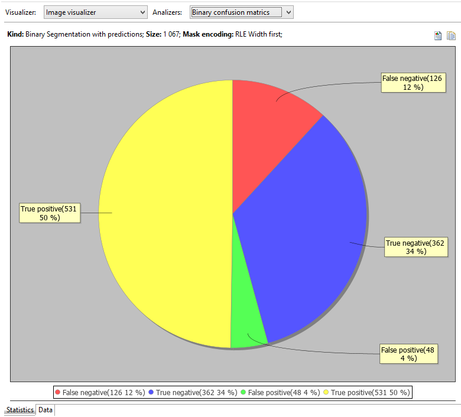
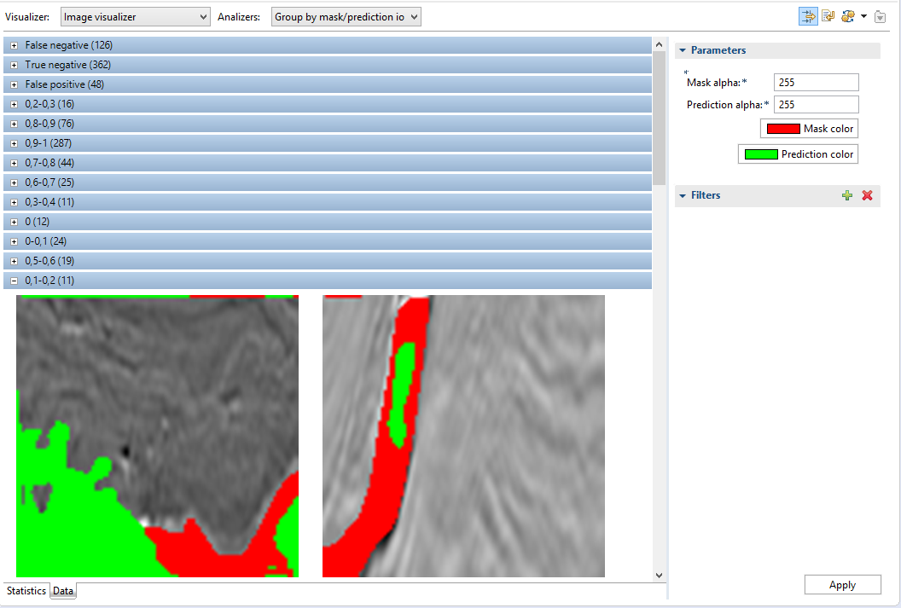

# Getting started
### Download
[Download Musket IDE for Windows](https://github.com/petrochenko-pavel-a/ds-ide/releases/download/M1/dside-1.0.0.t201911210735.zip) 

[Download Musket IDE for Linux](https://github.com/petrochenko-pavel-a/ds-ide/releases/download/M1/dside-1.0.0.t201911210735.tar.gz)

#### Nightly builds:

We publish nightly build to the [Source forge](https://sourceforge.net/projects/musket-ide/files/)

### Installation

Install all of [Musket ML](../generic/index.md) Python packages. Read installation instructions [here](../generic/index.md#installation).

Note: if only [Generic pipeline](../generic/index.md) package of 
[Musket ML](https://musket-ml.com/) is installed, you way also consider
to Install [Segmentation Pipeline](../segmentation/index.md), 
[Classification Pipeline](../classification/index.md) and
[Musket Text](../text/index.md).

Unzip and launch executable (`ds-ide.exe` for Windows and `ds-ide` for MacOS).

### Watch this in action

Most of the following contents can be also checked in action in [this video](https://www.youtube.com/watch?v=Hck1CH49-YQ&list=PLyV40LHl22j5VOv2DgHoNDkpxkfueIQmn&index=5&t=0s).

### Setting up a project

Launch `File->New...` from the main menu.

Choose `Musket->Musket Project` in the `New` dialog.


Click `Next`, enter new project name and click `Please configure an interpreter...` to set up python interpreter.

Try `Config first in PATH` option first, if it fail o auto-detect you python, use other options.


Click `Finish` and accept opening the new perspective.

This will create the project structure for you, details regarding the structure can be found [here](../generic/index.md#project-structure).

### Getting dataset from Kaggle

#### Installing kaggle stuff 
This should be done only once, first time you are getting something from Kaggle.

Run `pip install kaggle` in console.

Log into [Kaggle](https://www.kaggle.com)
Click on a profile in the top-right corner and choose `My Account`

On the account page find `Api` section and click `Create New API Token`. 
This will launch the download of `kaggle.json` token file.
Put the file into `~/.kaggle/kaggle.json` or `C:\Users\<Windows-username>\.kaggle\kaggle.json` depending on OS.

Note: there are potential troubles of creating `C:\Users\<Windows-username>\.kaggle` using windows explorer. 
To create this folder from console, run `cmd` and launch the following commands:
`cd C:\Users\<Windows-username>`, `mkdir .kaggle`.

Consult to [Kaggle API](https://github.com/Kaggle/kaggle-api) in case of other troubles.

#### Downloading the dataset

Back to IDE. Select your new project root in project explorer, right-click and select `New->Other`...


Choose `Musket->Kaggle Dataset`.


Click `Next` and select `competition`, enter `salt` into a search box and click `Search`.


Select `tgs-salt-identification-chellenge` and click `Finish`.

This will start dataset download, check its progress in console.

### Analysing dataset

In project explorer, double-click on the newly downloaded `train.csv`


Dataset editor displays CSV contents statistics, if the data is recognizable.



`Analyzers` combo allows to switch between dataset analysis modes.


In this simple binary segmentation there is an only suitable analyzer, 
but in other uses cases there are more.

So, the statistics on the screenshot is the output of the analyzer. 
Besides that, analyzer also splits and sorts data, and we can see that on `data` tab.

Visualizers are used to display that data, in our case, as we got raw images, there is an only visualizer.


Masks are also displayed.

### Creating an experiment

Following should be done to make an experiment from the dataset:

Click the `Generate` button in the toolbar in the top-right corner of the viewer.


Choose a name like `train_ds` and `Generate Musket Wrappers`, click `Ok`.


Accept to configure an experiment, enter any name like `exp01` and click `Finish`.

You now have `exp01` folder inside `experiments` folder and `config.yaml` file there.

`datasets.py` is also generated inside `modules` folder.

### Editing an experiment

We've got a default experiment for binary segmentation generated in the previous chapter.

You can always find it in project explorer:


Its contents can be edited by double-clicking on the experiment.


Lets make some minor changes to experiment code.

Change the shape to be well eaten by the network to:

Change `shape` instruction for `shape: [224,224, 3]`

Lets reduce the count of folds from default 5 to 3 to speed things up:

Add `folds_count: 3` instruction to the root level.

Add some holdout so we can track the effectiveness of the trained experiment:

Add `testSplit: 0.2` instruction to the root level.

And add an instructions to dump validation and holdout predictions to CSV right after the training.

Add `dumpPredictionsToCSV: true` instruction to the root level.

### Running an experiment

Click on `Launch experiment` in the tool bar of the editor.


This should launch an experiment, you can track what's going on in the console.

### Checking results and logs

When the experiment is finished, overal statistics should appear in the `Results and logs` tab:


It must also generate `summary.yaml` file in the experiment folder and `metrics*.csv` files in `metrics` subfolder.

Check these files, they contain lots of useful statistics.

`Logs` tab display logs in graphical form.


`Log` combo switches between different logs we got, in our case there is one per fold.


We've got following metrics declared in the experiment YAML code:

```yaml
metrics: #we would like to track some metrics
  - binary_accuracy
  - dice
```

So the `Metric` combo lists all of them (for the specific fold) and loss:


### Checking predictions

As we dumped our validation and holdout predictions to CSV by adding 
`dumpPredictionsToCSV: true` instruction to the root level of our YAML, 
now we have a bunch of CSV files in the `predictions` folder of our experiment.

You can use those files directly, our just click the links that appear on the `Results and logs`/`Results` tab:


This opens up the viewer with visualizers and analyzers that we already seen,
this time for particular prediction.

Statistics tab, as usual, displays some chart.


Check out `Analyzers` combo, this time there are more of them.


`Data` tab, which grouping is affected by the current analyzer displays samples with mask and prediction.


### What is next

Check the videos to find out what else can be done using Musket IDE: [tutorials](https://www.youtube.com/playlist?list=PLyV40LHl22j5VOv2DgHoNDkpxkfueIQmn).